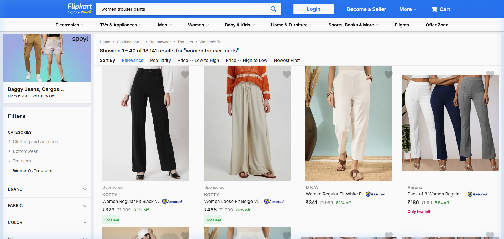
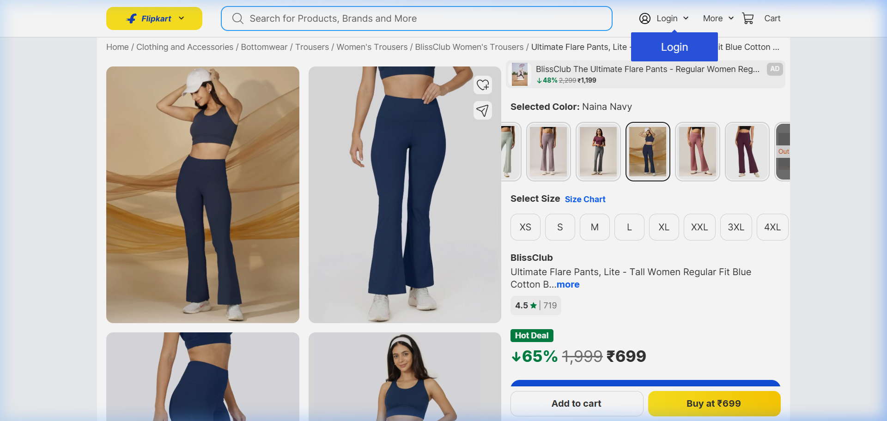
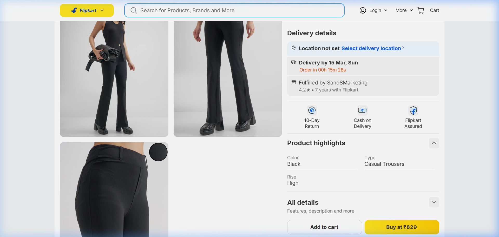

# 🔍 Flipkart Competitor Research: Women's Trouser Pants (₹500-1000)

> Research conducted on March 12, 2026 — Flipkart search: "women trouser pants"

---

## 📸 Research Screenshots

### Search Results Grid


### BlissClub (₹699) — Gallery Overview


### Tokyo Talkies (₹829) — Gallery with Detail Shot


---

## 📊 Search Grid Analysis

- **13,141 results** — even more competitive than Amazon (8,000+)
- Default sort is **Relevance**, not popularity
- Top sponsored slots dominated by **KOTTY** brand (₹323-466) — budget players with "83% off" pricing
- **Budget listings (₹180-400)** flood the grid with multi-packs and basic images
- Premium listings (₹600+) immediately stand out due to **higher image quality and styling**

### Grid Visual Patterns

| Pattern | Flipkart Observation |
|---|---|
| **Background variety** | Much more diverse than Amazon — grey studios, warm tones, off-white, even colored backgrounds |
| **Model styling** | More fashion-forward — styled with accessories, bags, boots |
| **Product-to-frame ratio** | Varies wildly — budget sellers use small product, premiums fill the frame |
| **Image resolution** | Clear quality gap between ₹200 and ₹700 listings |

---

## 🏆 Key Competitor #1: BlissClub (₹699, 4.5★, 719 Reviews)

BlissClub is a **D2C athleisure brand** and the top premium result in this segment.

### Image Gallery Breakdown

| Image # | Type | Description |
|---|---|---|
| 1 | **Lifestyle Hero** | Full-body front view, model wearing matching sports bra + white cap, **golden/warm fabric backdrop** (not white!) |
| 2 | **Side/Fit View** | Cropped from waist down, model in matching set, shows flare and leg length |
| 3 | **Back View** | Waist-down back angle in matching outfit |
| 4 | **Lifestyle Variant** | Model with headband, face visible, warm smile — emotional connection |
| 5+ | **Color Variants** | Multiple colors shown as separate styled thumbnail images |

### What Makes BlissClub Win on Flipkart

- ✅ **Brand storytelling through images** — every image feels like it belongs on a lifestyle brand's Instagram
- ✅ **Warm, textured backgrounds** (golden/beige fabric drape) — premium feel, NOT clinical white
- ✅ **Matching sets** — selling a lifestyle, not just pants
- ✅ **8+ color variants** visible — gives impression of established brand
- ✅ **4.5★ with 719 reviews** — massive social proof
- ✅ **White sneakers** as footwear — clean, modern, relatable

### What BlissClub Does NOT Do

- ❌ No infographic/feature callout images
- ❌ No fabric close-up/texture detail shots
- ❌ No size chart image in gallery
- ❌ Relies on brand recognition, not product education

---

## 🏆 Key Competitor #2: Tokyo Talkies (₹829)

Tokyo Talkies takes a completely **high-fashion editorial** approach.

### Image Gallery Breakdown

| Image # | Type | Description |
|---|---|---|
| 1 | **Fashion Hero** | Full body, model holding a leather handbag/clutch, grey studio background with floor shadows |
| 2 | **Rear 3/4 View** | Side-back angle showing trouser silhouette with boots |
| 3 | **Fabric Detail** | Close-up of back pocket area with a small circular fabric swatch overlay showing texture |
| 4+ | **Additional angles** | More styled views |

### What Makes Tokyo Talkies Stand Out

- ✅ **Editorial/fashion shoot quality** — looks like Zara/H&M imagery
- ✅ **Props: leather handbag, platform boots, minimal jewelry** — sells aspiration
- ✅ **Grey studio background with floor shadows** — creates depth and dimension
- ✅ **Fabric swatch overlay** on detail shot — clever technique showing texture without losing the lifestyle feel
- ✅ **High-rise styling** clearly visible — model in bodysuit/fitted top

### What Tokyo Talkies Does NOT Do

- ❌ No text overlays or infographics
- ❌ No size chart
- ❌ Fewer images than BlissClub
- ❌ Relies purely on visual luxury to justify ₹829

---

## 🔑 Flipkart vs Amazon: Critical Differences

| Factor | Amazon | Flipkart |
|---|---|---|
| **Main image background** | **Pure white #FFFFFF mandatory** | **Flexible** — grey, warm, textured backgrounds all allowed |
| **Image philosophy** | Clinical, compliant, zoom-worthy | **Lifestyle, aspirational, fashion-forward** |
| **Price justification** | Through fabric details + infographics | Through **styling, props, and editorial quality** |
| **Infographic usage** | Very common and effective | Rare in fashion — images speak for themselves |
| **Model face visibility** | Often cropped out (product focus) | **Face visible** — emotional connection matters |
| **Props/accessories** | Minimal (just white sneakers) | **Encouraged** — bags, boots, caps, headbands |
| **Text overlays** | Acceptable in secondary images | **Avoided** by premium brands |
| **Brand dominance** | Less — individual sellers compete | **Strong** — D2C brands dominate premium segment |

---

## 🎯 Recommended Flipkart Image Strategy

### Your Flipkart-Specific Main Image Should:

1. **Use a warm studio background** — soft beige/light grey with natural floor shadow (NOT pure white)
2. **Show the model more fully** — include face or at least chin level (builds emotional connection)
3. **Style with intention** — pair with a fitted crop top, clean sneakers, possibly a minimal accessory
4. **Create depth** — subtle floor reflection or shadow underfoot

### What You Can Do That Competitors Don't:

| Gap in Competitors | Your Opportunity |
|---|---|
| BlissClub = no fabric detail | Add a **Tencel texture close-up** — your fabric is your weapon |
| Tokyo Talkies = no infographics | Add a subtle **feature highlight image** (not text-heavy, but elegant) |
| Neither shows walking/motion | Your **walking shot** gives comfort proof they both lack |
| Neither calls out fabric type | **"100% Tencel"** messaging differentiates from cotton generics |

---

## 📝 Combined Strategy (Amazon + Flipkart + Meesho)

### Option C Finalized: Shared Core + Platform-Specific Mains

```
📸 GENERATE ONCE (Shared Core — 4 images):
├── Back view (model on neutral background)
├── Walking/motion view (shows fabric drape and flow)
├── Pocket/waistband detail close-up
└── Fabric texture extreme close-up

🎯 PLATFORM-SPECIFIC MAINS (3 images):
├── Amazon:    Pure white #FFFFFF, clinical, waist-down, sharp contrast
├── Flipkart:  Warm studio, grey/beige background, styled, aspirational
└── Meesho:    Slightly warm, clean, realistic, trust-building

📊 TOTAL PER SKU: 7 images (4 shared + 3 platform-specific)
```

> [!IMPORTANT]
> **The biggest takeaway from both platforms:** At ₹700-800, you're NOT competing on price. You're competing on **perceived value**. Amazon demands you prove value through detail and specifications. Flipkart demands you prove value through lifestyle and aspiration. Your image strategy must address BOTH.
